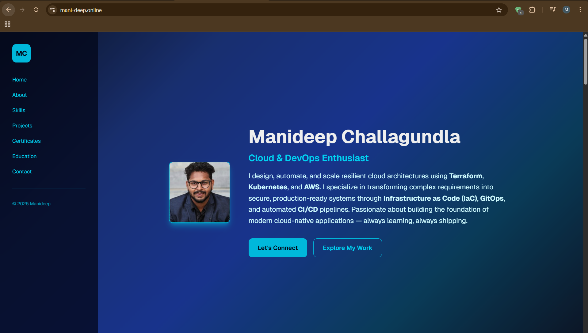
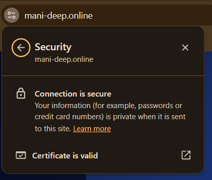
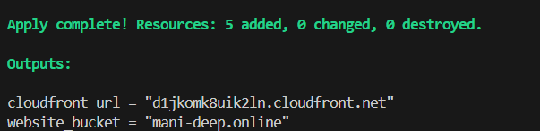
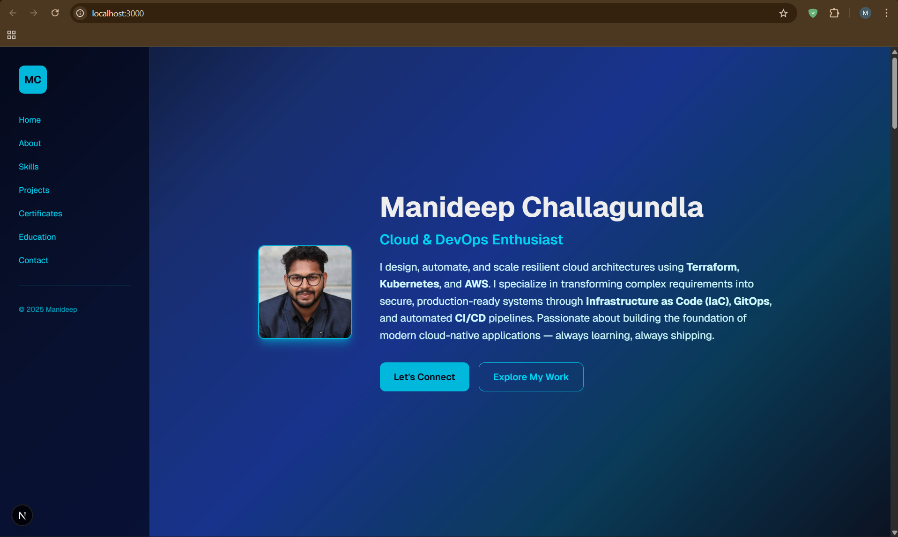

# 🚀 Automated Cloud Portfolio: Next.js + AWS + Terraform + GitHub Actions

A **production-grade**, globally distributed personal portfolio built with a "Production-First" mindset.  
This project showcases real-world DevOps: IaC with Terraform, secure AWS hosting (S3 + CloudFront), automated CI/CD via GitHub Actions, and custom domain with HTTPS.

🌐 **Live Demo**  
https://www.mani-deep.online  
(SSL/TLS secured via AWS ACM, global low-latency via CloudFront)

  

  
*(Connection secure & valid ACM certificate)*

  
*(Clean apply: 5 resources created)*

## 🛠 Tech Stack

- **Frontend**: Next.js 14 (Static Export / SSG) + TypeScript  
- **Styling**: Tailwind CSS + shadcn/ui  
- **Cloud**: AWS (S3 private bucket, CloudFront CDN, ACM HTTPS, IAM least privilege)  
- **IaC**: Terraform (S3 backend + DynamoDB locking, multi-region: ap-south-1 + us-east-1)  
- **CI/CD**: GitHub Actions (build → S3 sync → CloudFront invalidation)  
- **DNS**: GoDaddy (CNAME + 301 forwarding)  

## 🏗 Project Phases

### Phase 1 – Local Development
- Responsive Next.js portfolio with app router  
- Git best practices + optimized .gitignore  

  
*(Dev server at localhost:3000)*

### Phase 2 – IaC with Terraform
- Remote state in S3 + DynamoDB locking  
- Private S3 bucket + OAC for CloudFront-only access  
- Multi-region: Resources in Mumbai, ACM cert in Virginia  

### Phase 3 – Global Delivery
- Static files from `./out/` synced to S3  
- CloudFront for edge caching & low latency  
- HTTPS enforced + root object `index.html`  

### Phase 4 – DNS & SSL
- GoDaddy CNAME → CloudFront domain  
- ACM certificate validation & attachment  
- Root domain forwarding to www  

### Phase 5 – CI/CD Automation
GitHub Actions workflow on `push` to `main`:
1. `npm run build` → static `out/`  
2. `aws s3 sync ./out/ s3://manideep-portfolio/ --delete`  
3. `aws cloudfront create-invalidation` → global cache clear  

## 🚀 How to Run Locally

```bash
git clone https://github.com/Mani0013/mani-deep-portfolio.git
cd mani-deep-portfolio
npm install
npm run dev
# Open http://localhost:3000
